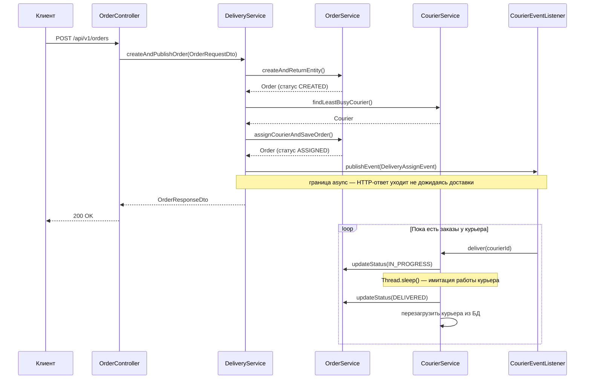

# Delivery Service

Учебный проект — REST API сервис доставки на Spring Boot + Kotlin. Клиент создаёт заказ, система сама находит свободного курьера и отправляет его доставлять, не заставляя клиента ждать.

## Как это работает

Когда приходит запрос на создание заказа:
1. Создаётся заказ в базе
2. Находится наименее загруженный курьер (SQL-запросом, не в коде)
3. Курьер назначается на заказ
4. Запускается асинхронная доставка — клиент получает ответ сразу, не дожидаясь пока курьер доедет



## Что внутри

**Язык и фреймворк:** Kotlin, Spring Boot 3

**База данных:** PostgreSQL, Spring Data JPA + Hibernate

**Асинхронность:** Spring `@Async` + `ApplicationEventPublisher`

**Документация API:** Swagger UI (springdoc-openapi)

## Сущности

- **Client** — клиент, который делает заказы
- **Product** — товар с названием и ценой
- **Order** — заказ клиента со списком товаров и курьером; живёт в статусах `CREATED → ASSIGNED → IN_PROGRESS → DELIVERED`
- **Courier** — курьер, который доставляет заказы

## Структура пакетов

Пакеты организованы по фичам, не по типам классов:

```
src/main/kotlin/com/maxim/delivery/
├── client/                  # всё про клиентов
├── courier/                 # всё про курьеров
├── order/                   # всё про заказы
├── product/                 # всё про товары
├── deliveryManagement/      # оркестратор: связывает заказ с курьером
├── CourierEventListener.kt  # слушает события и запускает доставку в фоне
├── DeliveryAssignEvent.kt   # событие "заказ назначен курьеру"
└── ApplicationBootstrap.kt  # заполняет базу тестовыми данными при старте
```

## Запуск

### Нужно

- JDK 21
- PostgreSQL на порту `5433`

### Поднять базу через Docker

```bash
docker run -d \
  --name delivery-db \
  -e POSTGRES_DB=delivery \
  -e POSTGRES_USER=maxim \
  -e POSTGRES_PASSWORD=password \
  -p 5433:5432 \
  postgres:15
```

### Запустить приложение

```bash
./mvnw spring-boot:run
```

При старте `ApplicationBootstrap` сам создаёт тестовые данные: 3 курьера, 3 товара, 1 клиент и 10 заказов — они сразу уходят на доставку.

Swagger UI: [http://localhost:8080/swagger-ui/index.html](http://localhost:8080/swagger-ui/index.html)

## API

### Заказы
| Метод | Путь | Описание |
|---|---|---|
| `GET` | `/api/v1/orders` | Список всех заказов |
| `POST` | `/api/v1/orders` | Создать заказ |

### Курьеры
| Метод | Путь | Описание |
|---|---|---|
| `GET` | `/api/v1/couriers` | Список всех курьеров |
| `POST` | `/api/v1/couriers` | Добавить курьера |

### Клиенты
| Метод | Путь | Описание |
|---|---|---|
| `GET` | `/api/v1/clients` | Список всех клиентов |
| `POST` | `/api/v1/clients` | Добавить клиента |

### Товары
| Метод | Путь | Описание |
|---|---|---|
| `GET` | `/api/v1/products` | Список всех товаров |
| `POST` | `/api/v1/products` | Добавить товар |

## Настройки

`src/main/resources/application.yml`:

```yaml
spring:
  datasource:
    url: jdbc:postgresql://localhost:5433/delivery
    username: maxim
    password: password
  jpa:
    hibernate:
      ddl-auto: create-drop   # база пересоздаётся при каждом перезапуске
    show-sql: true
```

> `create-drop` удобен при разработке — не нужно чистить базу руками. В продакшне так делать нельзя.
